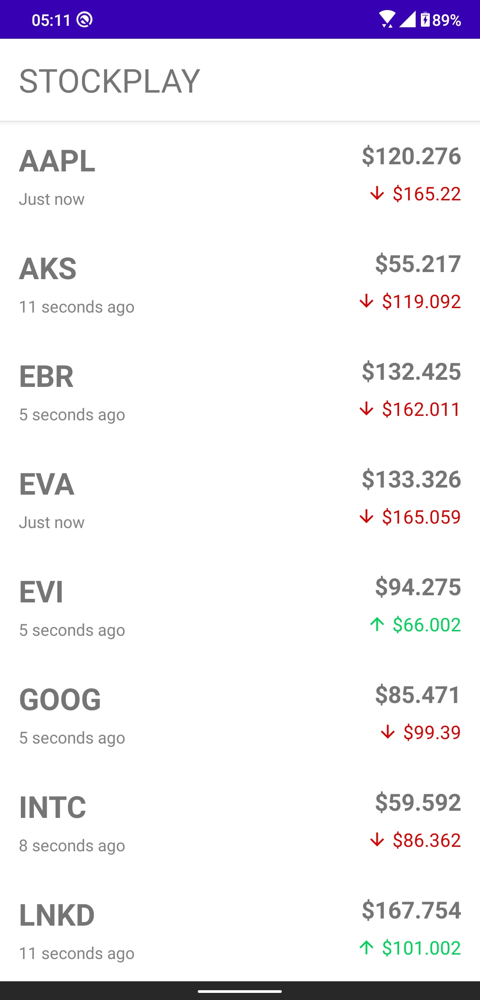

<h1 align="center">StockPlay</h1>

  

  
StockPlay is a sample Stocks app built with Dagger2 Hilt, Coroutines Flow, OkHttp-WebSocket and Room based on MVVM architecture.

 

## Built with
- Minimum SDK level 21
- [Coroutines](https://github.com/Kotlin/kotlinx.coroutines) + [Flow](https://kotlin.github.io/kotlinx.coroutines/kotlinx-coroutines-core/kotlinx.coroutines.flow/) for asynchronous work
- [Dagger2-Hilt](https://dagger.dev/hilt/) for dependency injection
- Android Jetpack
  - LiveData - notify domain layer data to views.
  - Lifecycle - dispose of observing data when lifecycle state changes.
  - ViewModel - UI related data holder, lifecycle aware.
  - [Room](https://developer.android.com/topic/libraries/architecture/room) - abstraction layer over SQLite
- Architecture
  - MVVM Architecture (View - DataBinding - ViewModel - Model)
  - Repository pattern
- [OkHttp](https://square.github.io/okhttp/) - WebSocket connection
- [GSON](https://github.com/google/gson) - Java serialization/deserialization library to convert Java Objects into JSON and back
- [Material-Components](https://github.com/material-components/material-components-android) - Material design components like ripple animation, cardView
